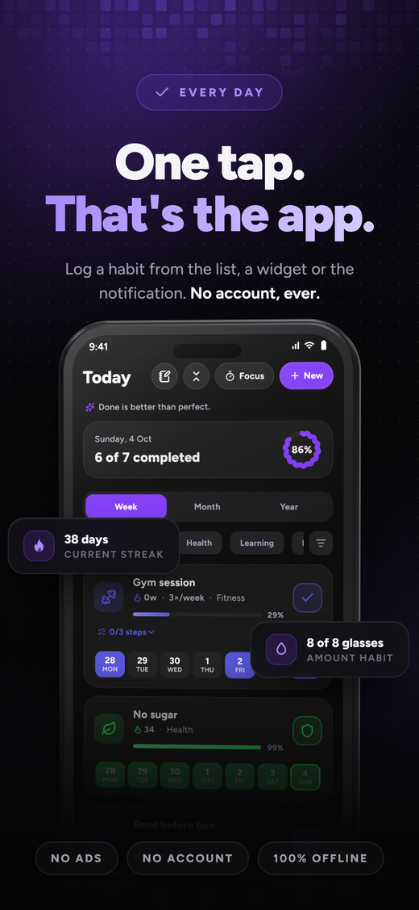
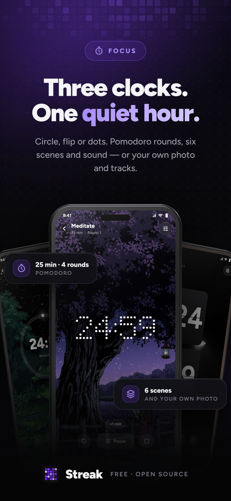
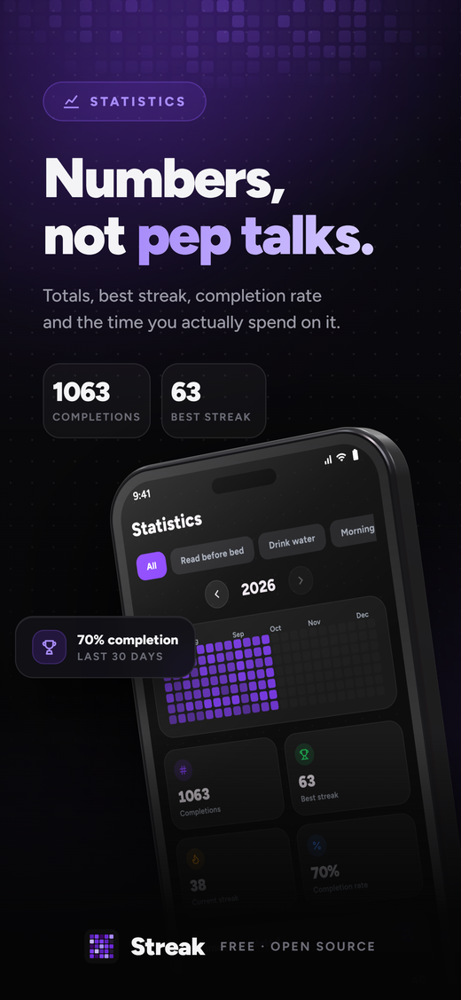
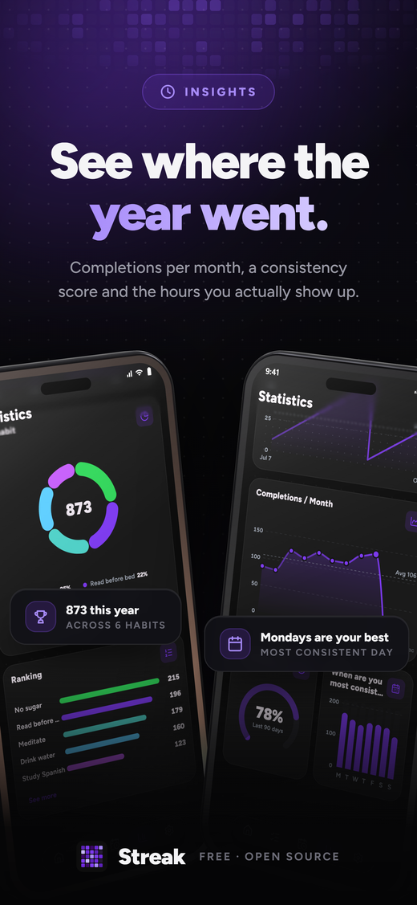
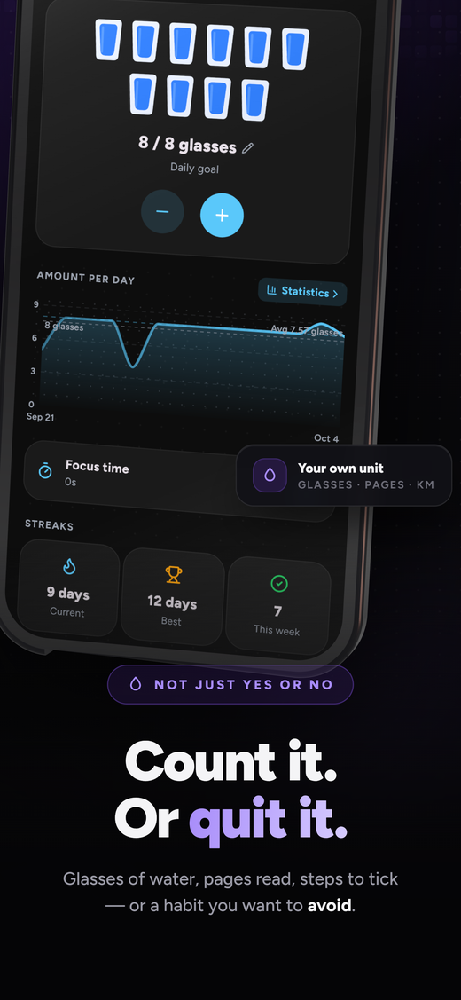
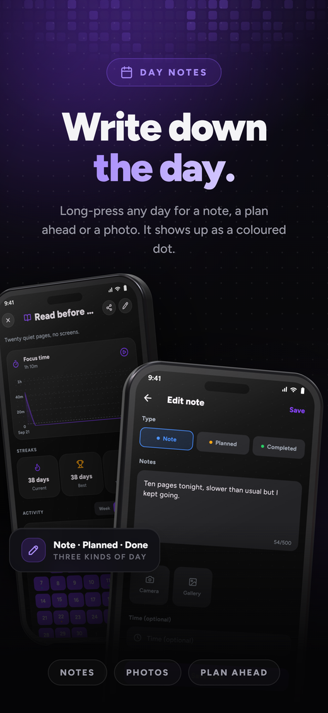
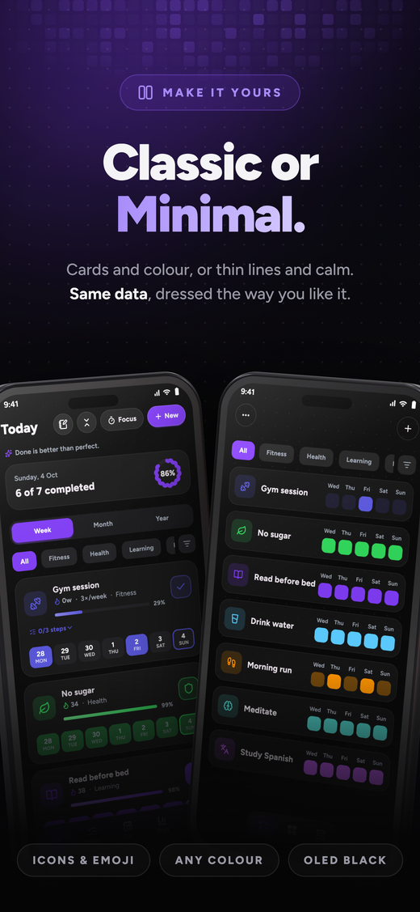
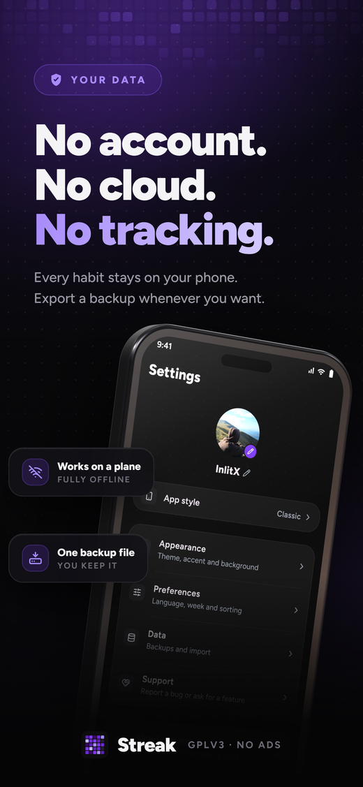

---

  <a href="../README.md">English</a> · <a href="README.es.md">Español</a> · <a href="README.zh-CN.md">中文</a> · <a href="README.ru.md">Русский</a> · <b>日本語</b>

### Streak

### ミニマルでプライベート、広告なしの習慣トラッカー

ワンタップで習慣を記録して、勢いを保ち、連続記録が伸びていくのを見届けましょう。

 

  
  
  
  
  
  

 

&nbsp;

&nbsp;

&nbsp;

&nbsp;
<a href="https://apps.obtainium.imranr.dev/redirect?r=obtainium://app/%7B%22id%22%3A%22com.streak.app%22%2C%22url%22%3A%22https%3A%2F%2Fgithub.com%2FInlitX%2Fstreak%22%2C%22author%22%3A%22InlitX%22%2C%22name%22%3A%22Streak%22%2C%22preferredApkIndex%22%3A0%2C%22additionalSettings%22%3A%22%7B%5C%22includePrereleases%5C%22%3Afalse%2C%5C%22fallbackToOlderReleases%5C%22%3Atrue%2C%5C%22filterReleaseTitlesByRegEx%5C%22%3A%5C%22%5C%22%2C%5C%22filterReleaseNotesByRegEx%5C%22%3A%5C%22%5C%22%2C%5C%22verifyLatestTag%5C%22%3Afalse%2C%5C%22dontSortReleasesList%5C%22%3Afalse%2C%5C%22useLatestAssetDateAsReleaseDate%5C%22%3Afalse%2C%5C%22trackOnly%5C%22%3Afalse%2C%5C%22versionExtractionRegEx%5C%22%3A%5C%22%5C%22%2C%5C%22matchGroupToUse%5C%22%3A%5C%22%5C%22%2C%5C%22versionDetection%5C%22%3Atrue%2C%5C%22releaseDateAsVersion%5C%22%3Afalse%2C%5C%22useVersionCodeAsOSVersion%5C%22%3Afalse%2C%5C%22apkFilterRegEx%5C%22%3A%5C%22%5C%22%2C%5C%22invertAPKFilter%5C%22%3Afalse%2C%5C%22autoApkFilterByArch%5C%22%3Atrue%2C%5C%22appName%5C%22%3A%5C%22%5C%22%2C%5C%22shizukuPretendToBeGooglePlay%5C%22%3Afalse%2C%5C%22allowInsecure%5C%22%3Afalse%2C%5C%22exemptFromBackgroundUpdates%5C%22%3Afalse%2C%5C%22skipUpdateNotifications%5C%22%3Afalse%2C%5C%22about%5C%22%3A%5C%22Streak%20is%20an%20open%20source%20habit%20tracker%20for%20Android.%20Build%20habits%20with%20one%20tap%2C%20watch%20your%20progress%20grow%2C%20and%20keep%20everything%20on%20your%20device.%20No%20accounts%2C%20no%20ads%2C%20no%20tracking.%5C%22%7D%22%2C%22overrideSource%22%3Anull%7D"></a>

 

  <a href="#機能">機能</a> ·
  <a href="#他のアプリからの移行">インポート</a> ·
  <a href="#ダウンロード">ダウンロード</a> ·
  <a href="#プライバシー">プライバシー</a> ·
  <a href="#翻訳">翻訳</a> ·
  <a href="#サポート">サポート</a>

---

<b>今日</b> · <b>フォーカス</b> · <b>統計</b> · <b>インサイト</b> · <b>量</b> · <b>メモ</b> · <b>カスタマイズ</b> · <b>無料でプライベート</b>

---

## 概要

Streak は Android、Windows、Linux 向けのオープンソースの習慣トラッカーです。
習慣はいくつでも作成でき、ワンタップで記録して、グリッドや連続記録のカウンター、
統計が埋まっていく様子を眺められます。

すべてのデータはお使いの端末に保存されます。アカウントも広告も、同期するものもありません。

---

## 機能

<table>
<tr>
<td width="50%" valign="top">

### 記録

- ホーム画面、ウィジェット、通知からワンタップで記録
- 3 種類の習慣：**通常**、**断つ**（リラプス記録付き）、**量**（単位と 1 日の目標を設定可能）
- **チェックリスト**で習慣をステップに分割し、すべてチェックしたら完了
- **柔軟なスケジュール**：毎日、週または月に X 回、指定した曜日、N 日ごと
- **過去の記録を補完**：任意の日をタップして追加・削除
- **日ごとのメモ**：日を長押しして出来事を書き残したり、写真を添付したり
- **休暇モード**で、記録を途切れさせずに習慣を一時停止

</td>
<td width="50%" valign="top">

### 進捗を見る

- 週・月・年単位で表示できる GitHub 風の**アクティビティグリッド**
- 週の始まりを月曜・土曜・日曜から選べる**月間カレンダー**
- **月ごとの達成数**で、1 年全体の流れがひと目でわかる
- **連続記録の推移**をグラフで表示し、線が伸びていくのを確認
- **「いつ一番続けられている？」**で、実際に取り組んでいる時間帯を発見
- 合計、最長・現在の連続記録、達成率、習慣ごとの**強さ**スコア
- 複数サイズで作れる**共有用の進捗カード**を、きれいな画像として書き出し

</td>
</tr>
<tr>
<td width="50%" valign="top">

### フォーカスセッション

- タイマーが必要な習慣のために。単独でも、習慣とその目標に紐付けても使える
- 短い休憩を挟む**ポモドーロ**、または長めの 1 セッション
- 3 種類の時計スタイル：**サークル**、**フリップ**、**ドット**
- 内蔵サウンド（雨、ブラウンノイズ、焚き火）や自分の音楽を、順番またはシャッフルで再生
- 落ち着いた風景や自分の写真を背景に設定
- タイマーを開いたままサブタスクをチェックし、画面をオンのまま維持
- **1 日のフォーカス目標**と、完了したすべてのセッションの履歴

</td>
<td width="50%" valign="top">

### 自分好みに

- **Classic、Minimal、Express**：タイポグラフィ、形状、モーションがそれぞれ異なる 3 つのデザイン
- ミニマルなアイコンパック、または好きな絵文字
- フルピッカーで選べるカスタムアクセントカラー
- ライト・ダークテーマに加え、5 種類のアプリ背景：単色、グラデーション、ドット、
  完全な黒の OLED、自分の写真
- カバー写真、カテゴリー、ドラッグでの並べ替え、プロフィール名と写真
- 3 種類のランチャーアイコンで、ホーム画面の雰囲気に合わせられる
- すべて達成した日には紙吹雪でお祝い

</td>
</tr>
<tr>
<td width="50%" valign="top">

### リマインダーとウィジェット

- 習慣ごとのリマインダーを、選んだ曜日または N 日ごとに。それぞれに短い励ましの一言付き
- 通知から直接使える**完了**、**スヌーズ**、**量を追加**ボタン
- **4 種類のホーム画面ウィジェット**：習慣、今日、統計、アクティビティグリッド
- ウィジェットごとに色や写真、不透明度、枠線を個別に設定
- **統計ウィジェット**に表示する数値とその並べ方を選択
- ウィジェットから直接チェックでき、アプリを開かずに保存
- アクティビティグリッドをタップすると、その習慣に移動

</td>
<td width="50%" valign="top">

### あなたのデータ

- Loop Habit Tracker、HabitKit、Habitica、HabitBull から履歴と連続記録ごと**インポート**。
  習慣と日付を含む CSV にも対応
- 自分で保管する 1 つのファイルでバックアップと復元
- 好きなフォルダーへ毎日または毎週の**自動バックアップ**
- ロック機能のない端末向けに、PIN や指紋による**アプリロック**
- 履歴を 1 日も失わずに習慣を**アーカイブ**
- すべてオフライン：アカウントもサーバーも、同期するものもなし
- 7 言語に対応。Weblate でさらに多くの言語を翻訳中

</td>
</tr>
</table>

---

## 他のアプリからの移行

<b>インポートの仕組み</b>

これまでの履歴をそのまま持ってこられます。Streak は **Loop Habit Tracker**、
**HabitKit**、**Habitica**、**HabitBull** のエクスポートを読み込めるので、過去の記録も
連続記録も引き継げます。習慣と日付を含むものであれば、その他の CSV も使えます。

<b>設定 → データ → 他のアプリからインポート</b>

---

## ダウンロード

[**F-Droid**](https://f-droid.org/packages/com.streak.app/) を使うのが一番簡単です。
Streak をインストールし、アップデートも自動で行ってくれます。
[**IzzyOnDroid**](https://apt.izzysoft.de/fdroid/index/apk/com.streak.app?repo=main)
や [**OpenAPK**](https://www.openapk.net/streak/com.streak.app/) でも入手できます。

Streak は Android、Windows、Linux で動作します：

| プラットフォーム | 状況 |
|----------|--------|
| Android | ✅ 対応 |
| Windows | ✅ 対応 |
| Linux | ✅ 対応 |
| iOS | 🚧 開発中 |
| macOS | 📅 予定 |

<b>Linux</b>

[**Releases**](https://github.com/InlitX/streak/releases) ページに、64 ビット x86 向けの
ファイルが 2 つあります：

| ファイル | 用途 |
|------|-----|
| `Streak-x86_64.AppImage` | どのディストリビューションでも：実行権限を付けて起動 |
| `Streak-linux-x64.tar.gz` | 任意の場所に展開して `Streak` を実行 |

Linux 版はリリースされたばかりなので、粗削りな部分があるかもしれません。リマインダーは
Streak を開いている間に鳴ります。うまく動かないことがあれば issue を開いてください。
見つかり次第修正します。

<b>APK を直接インストールする</b>

APK ファイルを直接使いたい場合は、
[**Releases**](https://github.com/InlitX/streak/releases) ページにあります。
ダウンロードサイズを抑えるため、端末の種類ごとにファイルを分けています：

| APK | 用途 |
|-----|-----|
| `Streak-arm64-v8a.apk` | 最近の 64 ビット端末、**通常はこちら** |
| `Streak-armeabi-v7a.apk` | 古い 32 ビット端末 |
| `Streak-x86_64.apk` | エミュレーターや x86 タブレット |

**Android 9 (Pie) 以降**で動作します。

APK を自分でインストールした場合は、[**Obtainium**](https://github.com/ImranR98/Obtainium)
を使うとアップデートを続けられます。`https://github.com/InlitX/streak` を追加すれば
Releases ページを追跡し、新しいバージョンが出たら知らせて、端末に合った APK を選んでくれます。

> [!NOTE]
>Streak は Play ストアでは配信していません。APK はストア経由ではないため、初回は
>ブラウザーやファイルマネージャーからのインストールを許可するよう Android に求められる
>場合があります。

---

## プライバシー

> [!IMPORTANT]
>Streak は**インターネットに一切接続しません**。これは設定項目ではなく、根本的な原則です。
>Android ではインターネット権限すら要求しません。アナリティクスも広告もアカウントも
>サーバーもなく、データが端末の外に出ることはありません。クラウドドライブなど別の場所に
>コピーを置きたい場合は、ご自身でエクスポートして保存してください。タップしたリンクは
>ブラウザーで開きます。

---

## 翻訳

翻訳は [**Weblate**](https://hosted.weblate.org/engage/streak/) で管理しています。
コーディングは不要で、ブラウザー上で短いフレーズを翻訳するだけです。新しい言語も歓迎します。

詳しくはこちら → [**TRANSLATING.md**](../TRANSLATING.md)

---

## コントリビュート

バグ報告、アイデア、プルリクエストはどれも歓迎です。
[**CONTRIBUTING.md**](../CONTRIBUTING.md) をご覧ください。ちょっとした修正より大きな変更の場合は、
方向性をすり合わせるため、まず issue を開いてください。

---

## インスピレーション

<b>Streak に影響を与えたアプリ</b>

Streak はこれらのアプリから多くを学びました：

- **[Loop Habit Tracker](https://github.com/iSoron/uhabits)**：習慣トラッカーは無料で
  オフラインでも、優れたものになれると証明してくれました。
- **[Grit](https://github.com/shub39/Grit)**：リストに生き生きとした印象を与える、
  ささやかなモーションを教えてくれました。
- **[HabitKit](https://www.habitkit.app/)**：1 年分の履歴を色付きのグリッドで見せることの
  美しさを教えてくれました。
- **[Habitica](https://github.com/habitRPG/habitica)**：続けること自体を祝う価値があると
  教えてくれました。

ゲーミフィケーションタブで作る島は、boona13 による MIT ライセンスのアイソメトリック
ボクセルアート **[Mykonos Island Voxels](https://github.com/boona13/mykonos-island-voxels)**
で描かれています。誰でも使えるように公開してくださり、ありがとうございます。

ホーム画面ウィジェットの連続記録の炎は、Microsoft による
**[Fluent Emoji](https://github.com/microsoft/fluentui-emoji)** の炎で、MIT ライセンスで
公開されています。

---

## サポート

Streak は無料でオープンソース、広告もありません。これからもそれは変わりません。

何かお返しをしたいと思ったら、スター、翻訳、わかりやすいバグ報告も、コーヒー 1 杯と同じくらい助けになります。

<b>暗号資産ウォレット</b>

<table align="center">
  <tr>
    <td align="center" width="130"> <b>Bitcoin</b></td>
    <td><code>bc1qm0r4pg8nknnjh3a7n2t63ckafhsz8jdd6qer29</code></td>
  </tr>
  <tr>
    <td align="center" width="130"> <b>Ethereum</b></td>
    <td><code>0x34b7A5552132cBca150Ae29c1E632faA49430e1a</code></td>
  </tr>
  <tr>
    <td align="center" width="130"> <b>Solana</b></td>
    <td><code>DC8dNEUNJhWdtBHBZAn4FTheVC3W4PtkGhbazvtk17Jo</code></td>
  </tr>
  <tr>
    <td align="center" width="130"> <b>Monero</b></td>
    <td><code>44SECMEf3rfV228kpy3Gs48wLmLXnq231gAMG7ULYoCWBWLYLHdwYV7YFkhMk31DR5P7SRAyRPyhkYaehtgEoajASz7qubq</code></td>
  </tr>
</table>

 
 

<a href="https://www.star-history.com/?repos=InlitX%2Fstreak&type=date&legend=top-left">
 <picture>
   <source media="(prefers-color-scheme: dark)" srcset="https://api.star-history.com/chart?repos=InlitX/streak&type=date&theme=dark&legend=top-left&sealed_token=aNqDTOocHK1NkSrMsZrD1iFDpo1AtZvvUo3ZqETCzSujh-eSh0ekwpay4FpVGocizt1wmR5QWrkuMUAl2r9yllwF4v9e3tnsI6c1lv0upumuFVgsXGvAwA" />
   <source media="(prefers-color-scheme: light)" srcset="https://api.star-history.com/chart?repos=InlitX/streak&type=date&legend=top-left&sealed_token=aNqDTOocHK1NkSrMsZrD1iFDpo1AtZvvUo3ZqETCzSujh-eSh0ekwpay4FpVGocizt1wmR5QWrkuMUAl2r9yllwF4v9e3tnsI6c1lv0upumuFVgsXGvAwA" />
   
 </picture>
</a>

 
 

<a href="../LICENSE"><b>GNU GPLv3</b></a> のもとで公開されており、同ライセンス第 7(b) 条に基づく<a href="../ADDITIONAL_TERMS.md">帰属表示条項</a>が付されています。

